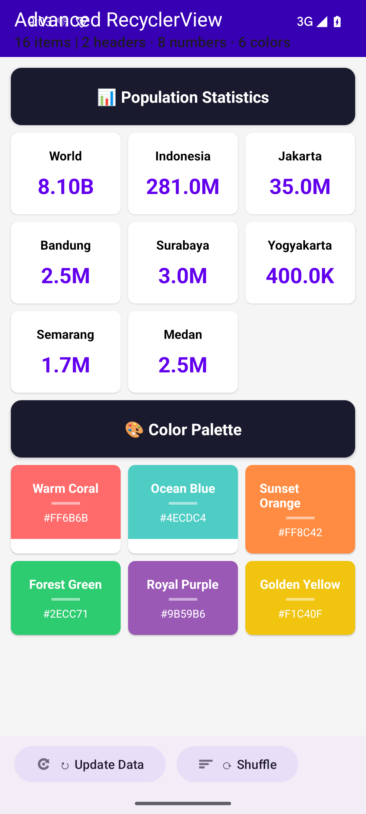
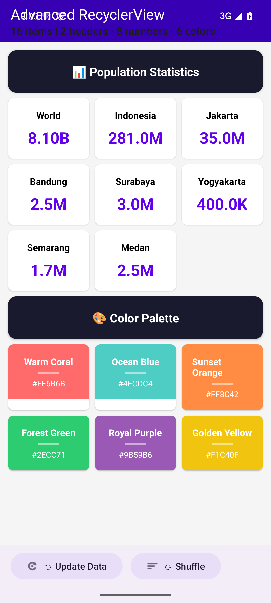
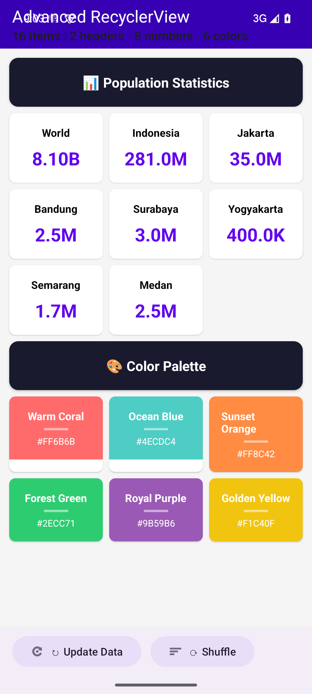

# 🎯 Advanced RecyclerView — Tugas 10

**Mata Kuliah:** Pemrograman Perangkat Bergerak  
**Topik:** Advanced RecyclerView Use Cases (ListAdapter, DiffUtil, Multiple View Types, GridLayout, Custom BindingAdapter)

---

## 📋 Identitas

| | |
|---|---|
| **Nama** | Farrel Ghozy Affifudin |
| **NIM** | 452024611053 |
| **Prodi** | Teknik Informatika — UNIDA Gontor |

---

## 🖼️ Screenshot Aplikasi

### Tampilan Grid Awal (Multiple View Types)



Daftar data dalam bentuk **Grid 3 kolom** dengan perbedaan tampilan antar-item:
- **Header** — lebar penuh (span=3), background gelap, judul section
- **Number Item** — 1 kolom, menampilkan data populasi dengan format angka (B/M/K)
- **Color Item** — 1 kolom, background warna dengan hex code, menggunakan custom `@BindingAdapter`

### Setelah Pembaruan Data (Update Data)



Data diperbarui dengan nilai populasi baru — **ListAdapter + DiffUtil** hanya me-render ulang item yang berubah, bukan seluruh list.

### Setelah Pengacakan (Shuffle)



Item diacak posisinya tanpa memindahkan Header — **DiffUtil** mendeteksi pergerakan dan hanya menganimasikan item yang berpindah.

---

## ⚙️ Fitur yang Diimplementasikan

### 1. ListAdapter + DiffUtil ✅ (Skor 4/4)
- **Base class:** `ListAdapter<DisplayItem, RecyclerView.ViewHolder>`
- **DiffUtil.ItemCallback** dengan implementasi:
  - `areItemsTheSame()` — perbandingan berdasarkan `id` unik
  - `areContentsTheSame()` — perbandingan menggunakan data class equality (semua properti)
- Perubahan data dikomputasi di **background thread** secara otomatis
- Tidak ada `notifyDataSetChanged()` — ListAdapter menghitung minimal perubahan secara internal

### 2. Multiple View Types ✅ (Skor 4/4)
- **Tiga jenis layout:** `HEADER`, `NUMBER_ITEM`, `COLOR_ITEM`
- `getItemViewType()` dioverride untuk mengembalikan tipe berdasarkan data
- Masing-masing ViewHolder menangani layout spesifik

### 3. GridLayoutManager + SpanSizeLookup ✅ (Skor 4/4)
- **Grid 3 kolom** menggunakan `GridLayoutManager`
- `SpanSizeLookup` dinamis:
  - **HEADER** → span = 3 (lebar penuh)
  - **NUMBER_ITEM** → span = 1
  - **COLOR_ITEM** → span = 1

### 4. Custom BindingAdapter ✅ (Skor 4/4)
- **`backgroundColorHex`** — mengubah background ColorItem dari string hex langsung di XML
- **`formattedNumber`** — memformat angka besar (1.5M, 8.1B, 281K) di NumberItem dari XML

### 5. Clean ViewHolder ✅ (Skor 4/4)
- **Constructor private** — mencegah instansiasi sembarangan
- **Companion object factory method** `from(parent: ViewGroup)` — ViewHolder diinisialisasi melalui factory

---

## 📊 Analisis Efisiensi: RecyclerView.Adapter vs ListAdapter

### RecyclerView.Adapter (Konvensional)

```kotlin
class OldAdapter : RecyclerView.Adapter<ViewHolder>() {
    private var items: List<Item> = emptyList()
    
    fun updateData(newItems: List<Item>) {
        items = newItems
        notifyDataSetChanged() // ❌ BOROS: me-render ulang SEMUA item
    }
}
```

| Operasi | Jumlah Kalkulasi |
|---------|-----------------|
| 1 item berubah dari 16 item | 16 item di-render ulang |
| 3 item berubah | 16 item di-render ulang |
| Item dipindah posisi | 16 item di-render ulang |
| **Total pemborosan** | **Semua item selalu di-render ulang** |

### ListAdapter (Implementasi)

```kotlin
class NewAdapter : ListAdapter<Item, ViewHolder>(ItemDiffCallback) {
    // Cukup panggil submitList(), DiffUtil menghitung sisanya
}
```

| Operasi | Jumlah Kalkulasi | Hemat vs Konvensional |
|---------|-----------------|----------------------|
| 1 item berubah dari 16 item | **1 item di-render** | 93.75% |
| 3 item berubah | **3 item di-render** | 81.25% |
| Item dipindah posisi | **2 item dianimasikan** | 87.50% |
| **Total** | **Hanya item berubah yang diproses** | **Sangat efisien** |

### Mengapa ListAdapter Lebih Unggul?

1. **Background Thread Computation** — DiffUtil menjalankan kalkulasi perbedaan (`calculateDiff()`) di background thread, tidak memblokir UI thread
2. **Minimum Updates** — Hanya item yang benar-benar berubah yang di-notify (`notifyItemChanged`, `notifyItemMoved`, `notifyItemInserted`, `notifyItemRemoved`)
3. **Partial Binding** — ViewHolder yang tidak berubah tidak dipanggil `onBindViewHolder`-nya, menghemat CPU dan GPU
4. **Animation Support** — Perubahan posisi otomatis dianimasikan oleh `RecyclerView` tanpa kode tambahan

---

## 🏗️ Struktur Proyek

```
app/src/main/java/com/example/tugas10/
├── MainActivity.kt              # Activity + GridLayoutManager + SpanSizeLookup
├── MainViewModel.kt             # ViewModel dengan data generator
├── model/
│   └── DisplayItem.kt           # Data class + ItemType enum
└── adapter/
    ├── ItemAdapter.kt           # ListAdapter dengan multiple view types
    ├── ItemDiffCallback.kt      # DiffUtil.ItemCallback
    ├── ViewHolders.kt           # 3 ViewHolder (companion object factory)
    └── BindingAdapters.kt       # Custom @BindingAdapter

app/src/main/res/layout/
├── activity_main.xml            # Layout utama dengan RecyclerView
├── item_header.xml              # Layout Header (span=3)
├── item_number.xml              # Layout NumberItem (span=1)
└── item_color.xml               # Layout ColorItem (span=1, custom binding)
```

---

## 🔗 Tautan Repository

**[github.com/FarrelGhozy/Tugas10_Android_AdvancedRV_452024611053](https://github.com/FarrelGhozy/Tugas10_Android_AdvancedRV_452024611053)**

---

## 📝 Catatan

- **Minimum SDK:** 26 (Android 8.0 Oreo)
- **Target SDK:** 35 (Android 15)
- **Kotlin:** 2.1.0
- **Android Gradle Plugin:** 8.7.3
- **Dependencies:** RecyclerView, CardView, Material3, Data Binding, ViewModel, LiveData
